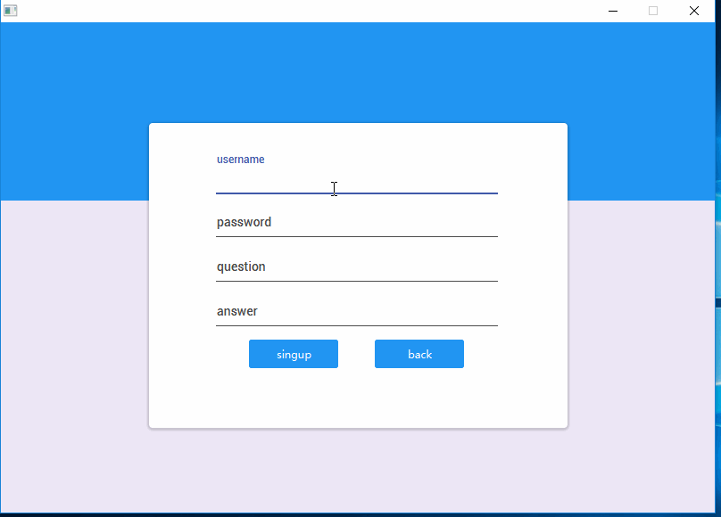

# Chatting based Java Socket and Javafx

### Some functions this App affords

+ sign in
+ sign up
+ change password
+ online chat
+ offline message delivery
+ online file transfering

### Details when coding

#### Server

+ Using database to store the information of every user and the offline message. The database is mysql and the driver is jdbc.

+ Analysis the message type from the first two characters rather than json.

+ Encrypt the information using DES.

+ There is a thread that do nothing but monitor any client applys to set up a link.

  Here is the calling graph of the server. I'm sorry that it is drawn by Chinese.

  

  You can get the all online and offline users informations when start the server.​

#### Client

+ Signin: When click signin, the  client will get the information you input and send them to server using TCP. Then the server will inqury the database to check if there is such a user with this username. If there is, it will send failling message to this client, otherwise these will be encrypted and stored in the database.

+ Signup: When click signup, the client will get the information you input and send them to server using TCP. Then the server will inqury the database to ckeck if there is such a user and if the user exists. If there exists such a user and the password corrects, the server will send successful message and go to the chatting scene. When get to the chatting scene, the client will send inqurying message to ask for the  online user information.

+ Change password: When you need to change the password, firstly, you need to offer username and the client will send a signal to get the security question you set when signning in.When you get the question, you can input the answer and new password. Then the client will send the answer and password to the server to verify the answer and change the password.

+ Chatting
  + Online chatting: When you send message to another user, the client will first send signal to server to check if the user is online.If so, the server will send the port and ip address and the client will connect to that user directly to exchange message.
  + Offline chatting: If the server discover that user is offline, all the message will be sent to the server and it will encrypt them and store.

+ File transfering: This is implemnted by UDP. Owing to unreliable UDP, I carry out reliable file transfer using the FSM below. The main idea is when timeout or the package is not correct I will retranfer this packge using GDN.

  + Sender FSM

  

  + Receiver FSM

  

  

**More details you can see README.pdf**.

